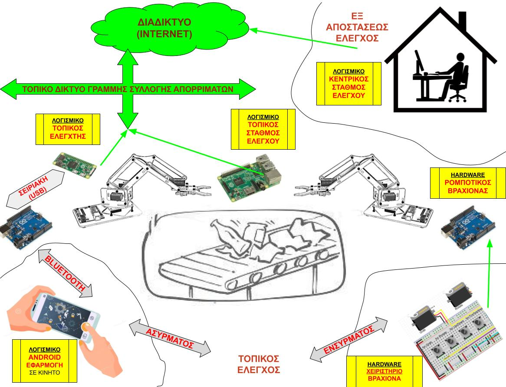
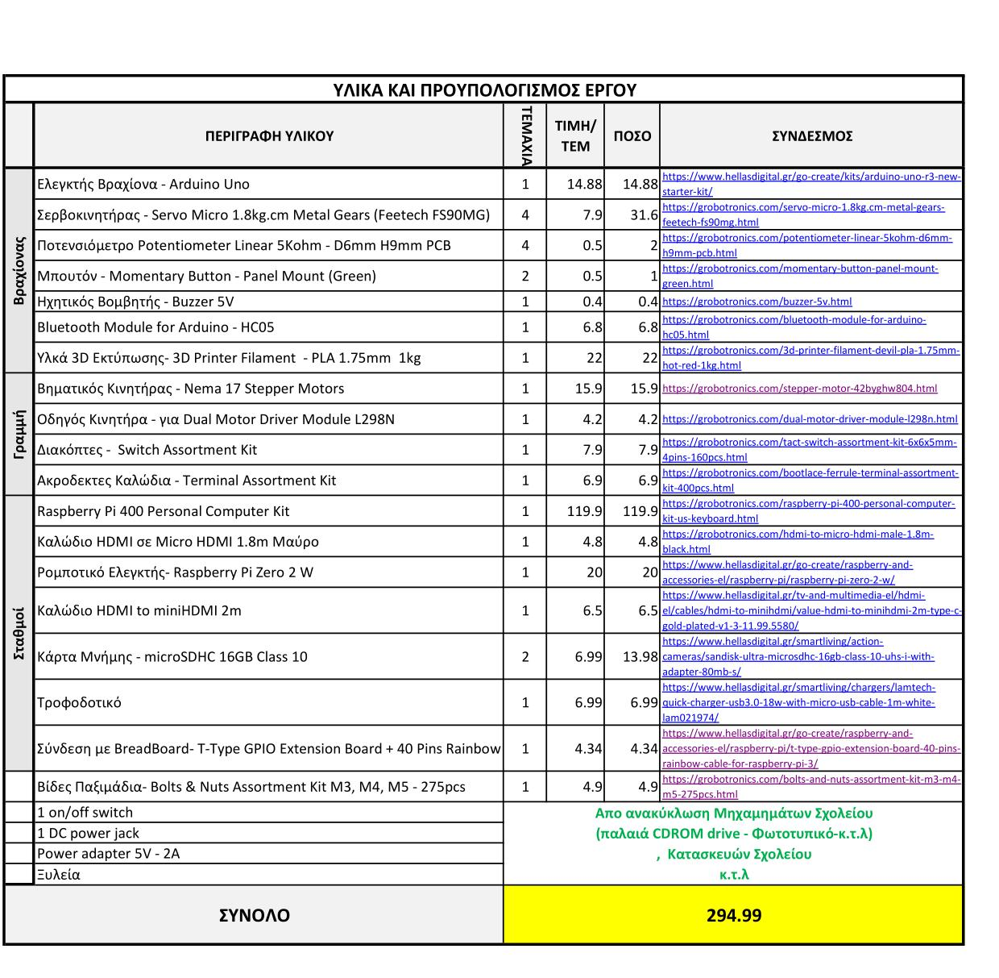

# remote-carbage-collecting-robot
Αποθετήριο του σχολείου "Εσπερινό ΕΠΑΛ Αλιάρτου" για στην συμμετοχή στον Διαγωνισμό Ανοιχτών Τεχνολογιών

**Ομάδα:  "Από μακριά και με Ασφάλεια"**(Οι μαθητές της **Β πληροφορικής** του Εσπερινού ΕΠΑΛ Αλιάρτου 

**Σχολείο:** Εσπερινό ΕΠΑΛ Αλιάρτου

**Τίτλος έργου:** «Σύστημα απομακρυσμένης συλλογής και διαλογής επικίνδυνων απορριμμάτων»

______

# Εποπτικό Διάγραμμα του Συστήματος

___

______

# ΑΡΧΙΚΗ ΠΡΟΤΑΣΗ ΤΟΥ ΕΡΓΟΥ

___

Παρακάτω περιγράφεται η πρόταση έργου για την συμμετοχή της ομάδας μας ,**" Από μακριά και με Ασφάλεια "**, στον «4ο Πανελλήνιο Διαγωνισμό Ανοιχτών Τεχνολογιών στην Εκπαίδευση»

## Εισαγωγή - Περιγραφή

Στην παρούσα πρόταση, η ομάδα μας προτείνει την κατασκευή ενός συστήματος, που σκοπός του είναι να εκτελεί απομακρυσμένη συλλογή και διαλογή επικίνδυνων απορριμμάτων.

Πιο συγκεκριμένα, το παραπάνω σύστημα,  είναι σχεδιασμένο έτσι ώστε  να εκτελεί ενέργειες,  οι οποίες είναι δύσκολες ή επικίνδυνες για τον άνθρωπο ,  σχετικά με την συλλογή  ή  διαλογή   επικίνδυνο ή γενικότερα δύσχρηστων  απορριμμάτων.

Καρδιά του συστήματος αυτού,   είναι ένας **ρομποτικός βραχίονας**,  ο οποίος εκπαιδεύεται να κάνει συγκεκριμένες κινήσεις συλλέγοντας και τοποθετώντας στα κατάλληλα μέρη για ανακύκλωση ή  απόσυρση   των επικίνδυνων αυτών απορριμμάτων.  Ο βραχίονας αυτός κάνει τις κινήσεις  με τη βοήθεια  **σέρβοκινητήρων** ,  οι οποίοι ελέγχονται από ένα Arduino. Ο έλεγχος της παραπάνω ρομποτικής συσκευής γίνεται είτε με **κατάλληλο χειριστήριο** που θα κατασκευαστεί , καθώς επίσης και μέσω κινητού τηλεφώνου και **εφαρμογής για Android**  κινητά ή ταμπλέτες.  

Ένας **Ρομποτικός ελεγκτής (Raspberry Pi Zero)**  είναι υπεύθυνος τόσο για την τοπική αποθήκευση των "συνταγών κινήσεων" κατά την διάρκεια της εκπαίδευσης  όσο και για την εκτέλεση τους όταν λάβει την κατάλληλη εντολή. Το σύστημα που προτείνουμε αποτελείται από ένα ρομποτικό βραχίονα αλλά σε μία πλήρη ανάπτυξη η γραμμή παραγωγής θα αποτελούνταν από πολλούς τέτοιους ρομποτικούς βραχίονες. 

Για το συντονισμό και ελέγχου όλης αυτής της αυτοματοποιημένης γραμμής συλλογής απορριμμάτων, είναι απαραίτητος ο  **Τοπικός Σταθμός Ελέγχου (Raspberry Pi 4)** .  Εκτός από τον προαναφερόμενο συντονισμό ο σταθμός αυτός είναι επιφορτισμένος και με  με το επικοινωνιακό έργο προς τον έξω κόσμο. Με άλλα λόγια ο σταθμός αυτούς Μπορεί να συνδεθεί στο διαδίκτυο internet και μέσα από εκεί να πάρει τις κατάλληλες εντολές για να εκτελέσει το έργο του.

Μέσα από την παραπάνω  δομή επιτυγχάνουμε το control room , **Ο Κεντρικός Σταθμός Ελέγχου**  να βρίσκεται οπουδήποτε στον κόσμο  σε ασφαλές περιβάλλον και μέσω αυτού  να μπορούμε να προγραμματίζουμε , να εποπτεύουμε  και να εκτελούμε όλες τις δύσκολες και επικίνδυνες ενέργειες  για την συλλογή επικίνδυνων ρύπων

# Τι παρόμοιο υπάρχει - Τρέχουσα αντιμετώπιση προβλήματος

Στην προσπάθειά μας να ερευνήσουμε την τρέχουσα κατάσταση και να παρατηρήσουμε τι λύσεις υπάρχουν σε παρόμοια προβλήματα καταλήξαμε στις παρακάτω διαπιστώσεις:

-  Υπάρχουν αρκετές συσκευές αυτοματοποίησης στον χώρο της συγκομιδής και διαλογής  απορριμμάτων,  όμως αυτές είναι προσανατολισμένες σε  **κεντρικοποιημένες  δομές μεγάλου κόστους** οι οποίες βασίζονται στην στη  **μεταφορά** από τους χώρους παραγωγής των απορριμμάτων στον κεντρικό σταθμό

-   το σύστημά μας μειώνει τις μεταφορές προτείνοντας την επιτόπου διαχείριση (κατά συνέπεια  **εξοικονόμηση πόρων** , καυσίμων και μείωση εκπομπών διοξειδίου του άνθρακα)

-    επενδύει στην  **εξ αποστάσεως εργασία**,  η οποία στις μέρες μας  γίνεται όλο και πιο ελκτική έως και απαραίτητη

-    θέτει σε πρώτο πλάνο την  **ασφάλεια του ανθρώπου  στο περιβάλλον εργασίας**

-    στηρίζεται σε  **ανοιχτές τεχνολογίες**  προσπαθώντας να αντικαταστήσει κλειστές και πολύ ακριβές κατασκευές

-    λόγω των ανοιχτών τεχνολογιών είναι  **εύκολα επεκτάσιμο και εξελίξιμο**

# Αναγκαιότητα του Έργου - Στόχοι

Σύμφωνα με την ανάλυση των δεδομένων που παρουσιάστηκαν στην προηγούμενη παράγραφο, προέκυψε η ιδέα και η πρόταση για το παρόν σύστημα.

Πιο συγκεκριμένα το σύστημα που προτείνουμε έχει τα παρακάτω χαρακτηριστικά τα οποία προσπαθούν να λύσουν τα προβλήματα που προέκυψαν κατά την έρευνά μας. Τα προτεινόμενα και επιθυμητά χαρακτηριστικά είναι τα εξής:

 - Στην δημιουργία  κλίματος  στην σχολική κοινότητα που να προωθεί την ανακύκλωση και την προστασία του περιβάλλοντος
- Την αφύπνιση  της περιβαλλοντικής συνείδησης των μαθητών

- Στην κατασκευή ρομποτικού βραχίονα κατάλληλου για χρήση σε σε δύσκολα και ρυπογόνα περιβάλλοντα

- Την προσθήκη ενός ρομποτικού βραχίονα ,  που αποτελεί ένα ακόμη χρήσιμο εργαλείο πολλαπλής χρήσης  στο εργαστήριο του σχολείου

- Την δημιουργία προτύπου για πειραματισμό της νέας αυτής ιδέας

- Την γενικότερη εξοικείωση με η συγκεκριμένη τεχνολογία

- Την δημιουργία πειραματικής υποδομής για μελλοντική επέκταση δικτύου ρομποτικών βραχιόνων  

---

# Δομή - Χρήση- Υλοποίηση του συστήματος

---

Το σύστημα περιλαμβάνει τα ακόλουθα μέρη:

1. **Ρομποτικός Βραχίονας**:Καρδιά του συστήματος αυτού, είναι ένας ρομποτικός βραχίονας, ο οποίος εκπαιδεύεται να κάνει συγκεκριμένες κινήσεις συλλέγοντας και τοποθετώντας στα κατάλληλα μέρη  τα επικίνδυνα  απορριμμάτα. 
	- **Μηχανικά Μέρη** : Τα περισσότερα από τα μέρη αυτά θα σχεδιαστούν σε ανοιχτό λογισμικό και θα εκτυπωθούν σε τρισδιάστατο εκτυπωτή.  Επίσης θα χρησιμοποιηθούν ,  όπου είναι δυνατόν, και ανακυκλώσιμα εξαρτήματα από παλαιό , προς απόσυρση εξοπλισμό του σχολείου
	- **Ηλεκτρικά Μέρη** : Ο βραχίονας αυτός κάνει τις κινήσεις με τη βοήθεια σέρβοκινητήρων , οι οποίοι ελέγχονται από ένα Arduino
	- **Έλεγχος Βραχίονα** : Ο έλεγχος της παραπάνω ρομποτικής συσκευής γίνεται με τους παρακάτω τρόπους
		-  **Ενσύρματα**: Τοπικά , με κατάλληλο χειριστήριο που θα κατασκευαστεί  και θα τοποθετηθεί πάνω στον βραχίονα , μέσω του οποίου, ο χειριστής θα μπορεί να ελέγχει ανεξάρτητα  και αναλογικά  κάθε κίνηση του βραχίονα. 
		-  **Ασύρματα**: Η ίδια λειτουργία με το παραπάνω χειριστήριο,  θα μπορεί να επιτευχθεί , αφού ο χρήστης δημιουργήσει μία **bluetooth σύνδεση** μέσω του κινητού του ή της ταμπλέτας του (**Android λειτουργικό**) και με τη χρήση **κατάλληλης εφαρμογή που θα δημιουργήσουμε**  κατά την υλοποίηση του έργου.  Για το σκοπό αυτό χρησιμοποιείται κατάλληλος πομποδέκτης bluetooth συνδεδεμένος με την πλακέτα του Arduino (ελεγκτής βραχίονα).
		-  **Μέσω Δικτυου**: Αφού έχει γίνει η **εκπαίδευση του ρομποτικού βραχίονα** στις κατάλληλες κινήσεις που θέλουμε,  τότε θα μπορεί ο βραχίονας να ελεγχθεί και μέσω δικτύου. Για τη συγκεκριμένη ενέργεια είναι απαραίτητοι  και οι σταθμοί ελέγχου ( οι επόμενοι δύο σταθμοί Raspberry - Τοπικός και Κεντρικός σταθμός ελέγχου).
2. **Ρομποτικός Ελεγκτής (Raspberry Pi Zero)** : Ένας Ρομποτικός ελεγκτής (Raspberry Pi Zero) είναι συνδεδεμένος με τη μονάδα Arduino του κάθε ρομποτικού βραχίονα  και αφιερωμένος στην διαχείριση μόνο του συγκεκριμένου βραχίονα. Είναι υπεύθυνος τόσο για την τοπική αποθήκευση των "συνταγών κινήσεων" κατά την διάρκεια της εκπαίδευσης όσο και για την εκτέλεση τους όταν λάβει την κατάλληλη εντολή.  Επικοινωνεί μέσω σειριακής Θύρας και USB   με τη μονάδα του Arduino . Επίσης συνδέεται και στο τοπικό δίκτυο  είτε μέσω wi-fi  είτε με κατάλληλο προσαρμογέας usb σε Ethernet.  Μέσω του τοπικού δικτύου μπορεί και ανταλλάσσει δεδομένα και δέχεται εντολές από τον **Τοπικό Σταθμό Ελέγχου (Raspberry Pi 4)** . . 
3. **Τοπικός Σταθμός Ελέγχου (Raspberry Pi 4)** : Η συγκεκριμένη μονάδα **ενορχηστρώνει όλη τη γραμμή συλλογής** και διαχωρισμού απορριμμάτων. Συνδέεται μέσω δικτύου με όλους τους **Ρομποτικούς Ελεγκτές (Raspberry Pi Zero)**   και μπορεί να τους ελέγχει και να τους συντονίζει  στην κατάλληλη ακολουθία  συντονισμένων κινήσεων για την επίτευξη του τελικού σκοπού. Κατάλληλο λογισμικό  που θα γίνει κατά την διάρκεια υλοποίησης του έργου  υλοποιεί την παραπάνω διαδικασία  εκτελέσεις  **δικτυακών σεναρίων  αυτοματισμού**.

4. **Κεντρικός Σταθμός Ελέγχου (Λογισμικό σε PC)** :Η μονάδα αυτή αποτελείται **μόνο από λογισμικό** , το οποίο μπορεί να εγκατασταθεί σε οποιαδήποτε  υπολογιστή  (PC ).  Η μόνη προϋπόθεση  είναι να υπάρχει **πρόσβαση στο διαδίκτυο**.  Σκοπός της είναι να εποπτεύει  και να ελέγχει ολόκληρη την γραμμή συλλογής και διαλογής .Επικοινωνώντας με τον **Τοπικό Σταθμό Ελέγχου (Raspberry Pi 4)**  της κάθε γραμμής,  μπορεί να του μεταδίδει τις εντολές και "τις συνταγές  κινήσεων"  που θέλει καθώς επίσης και να επιτηρεί την γραμμή. Μέσω αυτής,  υλοποιείται η από αποστάσεως  λειτουργία του συστήματος και η ασφαλής  διεκπεραίωση της εργασίας  αποφεύγοντας τους κινδύνους της παρουσίας ανθρώπου σε επικίνδυνα περιβάλλοντα.
5. **Δικτυακή Υποδομή** : Όπως ήδη αναφέραμε ο κεντρικός σταθμός του συστήματος θα συνδέεται στο τοπικό δίκτυο του σχολείου. Η προσπάθειά μας θα είναι να τοποθετηθεί σε μέρος το οποίο να είναι κοντά σε κάποιο Ethernet network switch έτσι ώστε να μπορεί να συνδεθεί με τους χρήστες . Επίσης δεν έχουμε προδιαγράψει κάποιον πρόσθετο δικτυακό εξοπλισμό έτσι ώστε να κάνουμε **ελαχιστοποίηση του κόστους του συστήματος**.

---

# Κύρια Χαρακτηριστικά

---
 - Στο Hardware  και στο software θα γίνεται χρήση αποκλειστικά ανοιχτών τεχνολογιών  και ανοιχτού λογισμικού (Raspberry Pi, Arduino, Python, Mit AppInventor 2,  Blender, κτλ)

 - Το όλο σύστημα  στα σχεδιαστεί  έτσι ώστε να παρέχεται   η μέγιστη επεκτασιμότητα  και θα ακολουθεί λογική αρθρωτού  σχεδιασμoύ.

 - Ο Ρομποτικός βραχίονας  θα μπορεί να εκπαιδευτεί  σε οποιοδήποτε ακολουθία κινήσεων ανάλογα με το σενάριο χρήσης

 - Η γραμμή  διαλογής  θα μπορεί  να επεκταθεί σε οποιοδήποτε αριθμό ρομποτικών βραχιόνων

 - Ο κεντρικός σταθμός θα αρχειοθετεί και θα οργανώνει  " συνταγές και σενάρια χρήσης"  τις οποίες θα ενεργοποιεί και θα αποστέλλει  κατά τη βούληση του χειριστή

- Ο κεντρικός σταθμός θα διαχειρίζεται λογαριασμός των διαφόρων χρηστών, δίνοντάς τους τα κατάλληλα δικαιώματα

---

# Υλικά - Λίστα υλικών - Κόστος

---

Το σύστημα που προτείνεται είναι αρθρωτό και μπορεί να υλοποιηθεί με κλιμακούμενες διαμορφώσεις. Το προϋπολογιζόμενο  **κόστος είναι 295**, στο προτεινόμενο  πλήρες σύστημα

ΥΚΙΚΑ
Ελεγκτής Βραχίονα - Arduino Uno 

Σερβοκινητήρας - Servo Micro 1.8kg.cm Metal Gears (Feetech FS90MG)

Ποτενσιόμετρο Potentiometer Linear 5Kohm - D6mm H9mm PCB

Μπουτόν - Momentary Button - Panel Mount

Ηχητικός Βομβητής - Buzzer 5V

Bluetooth Module for Arduino - HC05

Υλκά 3D Εκτύπωσης- 3D Printer Filament  - PLA 1.75mm  1kg

Βηματικός Κινητήρας - Nema 17 Stepper Motor

Οδηγός Κινητήρα - Dual Motor Driver Module L298N

Διακόπτες -  Switch Assortment Kit 

Ακροδεκτες Καλώδια - Terminal Assortment Kit
 
Raspberry Pi 400 Personal Computer Kit

Καλώδιο HDMI σε Micro HDMI 

Ρομποτικό Ελεγκτής- Raspberry Pi Zero 2 W

Καλώδιο HDMI to miniHDMI

Κάρτα Μνήμης - microSDHC 16GB Class 10 

Τροφοδοτικό 

Σύνδεση με BreadBoard- T-Type GPIO Extension Board 

Βίδες Παξιμάδια- Bolts & Nuts Assortment Kit M3, M4, M5 

1 on/off switch

1 DC power jack

Power adapter 5V - 2A

Ξυλεία 

Αναλυτικότερα το κόστος και τα υλικά :

και μπορεί να βρεθει στο παρακάτω αρχείο 	
[Αναλυτικά Υλικά και κόστος Συστήματος](https://github.com/epal-aliartou/recycle-to-art/blob/main/docs/Recycle-to-Art-KOSTOS1.pdf)

---

# Κατασκευή

---
Αναλυτική περιγραφή της κατασκευής θα επακολουθήσει σε μετέπειτα στάδια.

Προς το παρόν καταγράφουμε τα κυρίαρχα στάδια της κατασκευής

-  εξαγωγή και συλλογή ανακυκλώσιμων εξαρτημάτων από παλαιό εξοπλισμό

-  προμήθεια  νέων απαραίτητων εξαρτημάτων για κατασκευή του ρομποτικού βραχίονα

-  εκτύπωση σε τρισδιάστατο εκτυπωτή  των απαραίτητων υλικών σύνδεσης και στήριξης του ρομποτικού βραχίονα

-  προσαρμογή και κατασκευή βάσεων και θέσης  τοποθετήσης του βραχίονα

-   συναρμολόγηση  ηλεκτρικών και μηχανικών μερών 

-  εγκατάσταση απαραίτητου firmware  στο Arduino
-  δοκιμαστικές  κινήσεις και λειτουργία  του ρομποτικού βραχίονα

-   εγκατάσταση  λειτουργικού συστήματος και απαραίτητα λογισμικών στον Ρομποτικό Ελεγκτή (Raspberry Pi Zero) 
-   εγκατάσταση  λειτουργικού συστήματος και απαραίτητα λογισμικών στον Τοπικό Σταθμό Ελέγχου (Raspberry Pi 4) 

-  εγκατάσταση και έλεγχος σειριακής επικοινωνίας του Ρομποτικού Ελεγκτή με τον  ρομποτικό βραχίονα

-  εγκατάσταση και έλεγχος bluetooth επικοινωνίας κινητού τηλεφώνου με τον  ρομποτικό βραχίονα
-  δοκιμή δικτυακής επικοινωνίας μεταξύ Ρομποτικού Ελεγκτή και τοπικού σταθμού ελέγχου
-  δοκιμή δικτυακής επικοινωνίας μεταξύ τοπικού και κεντρικού σταθμού ελέγχου
-  δημιουργία δομής  και αυτοματοποίησης  της αρχειοθέτησης   των σεναρίων χρήσης και κίνησης .
-  δημιουργία  κατάλληλων χρηστών  στον κεντρικό σταθμό ελέγχου 

-  Τελικές συνολικές δοκιμές του συστήματος

-  Τεκμηρίωση λειτουργίας και συντήρησης

---

# Μελλοντικές επεκτάσεις

---

- Δημιουργία περισσότερων ρομποτικών βραχιόνων ,  σύνδεση του σε δίκτυο  και πειραματισμός
 με δικτυακά σενάρια αυτοματισμού

- δημιουργία γραφικό user interface  για τον κεντρικό  και τον τοπικό σταθμό

- δημιουργία εκπαιδευτικών σεναρίων χρήσης

- Επέκταση και δυνατότητα προγραμματισμού  ή  αυτοματισμού με Scratch , με σκοπό  την χρήση του από μικρότερες τάξεις και μαθητές μικρότερης ηλικίας  καθώς και την εισαγωγή τους στην ρομποτική

 - Επέκταση και δυνατότητα προγραμματισμού  ή  αυτοματισμού με python , με σκοπό  την χρήση  κατά τη διαδικασία  εκμάθησης της δημοφιλούς γλώσσας , η οποία είναι και μέρος του αναλυτικού προγράμματος

---

# Κοινωνική επίδραση

---

Σε βασικές γραμμές , μπορούμε να πούμε ότι οι κυριότερες κοινωνικές επιδράσεις είναι οι παρακάτω:

 -  Δημιουργία πνεύματος και κλίματος περιβαλλοντικής αφύπνισης 

 -  Τοποθέτηση της Ασφάλειας στο χώρο εργασίας στην πρώτη θέση

 -  Ενίσχυση  της χρήσης και αποδοχής ανοιχτών τεχνολογιών (με σκοπό την αντικατάσταση παρόμοιων κλειστών) 
 -  Κινητοποίηση καινοτομίας  και  παρόμοιων προτάσεων  από την ευρύτερη κοινωνία

 -  Δημιουργία διαδικασιών υποβοήθησης της ανακύκλωσης 

-  Ενίσχυση και υποβοήθηση προσωπικών ικανοτήτων και δεξιοτήτων των μαθητών 

-  Κινητροδότηση  των μαθητών για συμμετοχή σε ομαδικές  εργασίες

---